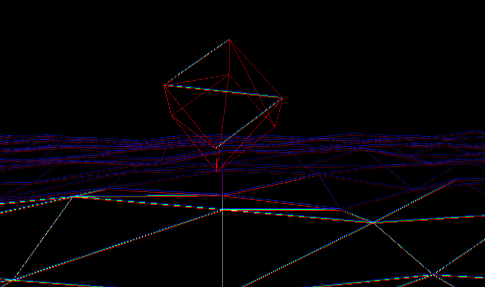

# Audio Visualiser 3D

## Demo
[The live demo is available in my website](https://ahabram.fr/audio-visualiser/)

## Description
This is a website that propose an auditive experience.  
Based on the user music, the website adapt its animations based on the drums of your music.  
I advise you to put a music with some drums and bass. The algorithm is really efficient with 
electro, trans, dupstep or even rap music.

## Dependencies
- Three.js - used for rendering the 3D scene
- SimplexNoise - used to animate the plane
- Web Audio API (js built-in library) - used to analyse the songs

## Technical Description
Before playing music:  
- Receiving the song from input
- Cloning the song to apply some filters on one & play the original song with the other one
- Applying a "LowShelf" filter to lower the intensity of the bass and keep the high frequencies
- Applying a "LowPass" filter to lower unwanted high frequencies (voices for example) and keep the highest frequencies (drums & hats)
- Applying a gain filter to increase all frequencies back (the drums frequencies should now be the highest)
- Playing the original song & live-analysing the filtered song

During the music:
- Getting the current frequencies in byte format
- Detecting the highest frequencies and parsing the next 20/50 bytes
- If the next 4 or 9 frequencies are still high, it's probably a drum
- If its a drum, I send the information to the 3D scene to increase animation speed, apply some shaders, ...

## Author
- Anas Habib ABRAM
> Contact: anas-habib.abram@hotmail.com  
> Personal Achievement: "I know how to make coffee"

## License
MIT